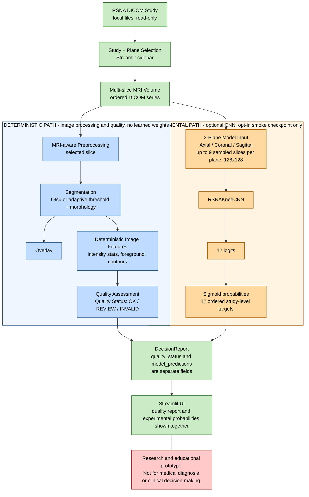
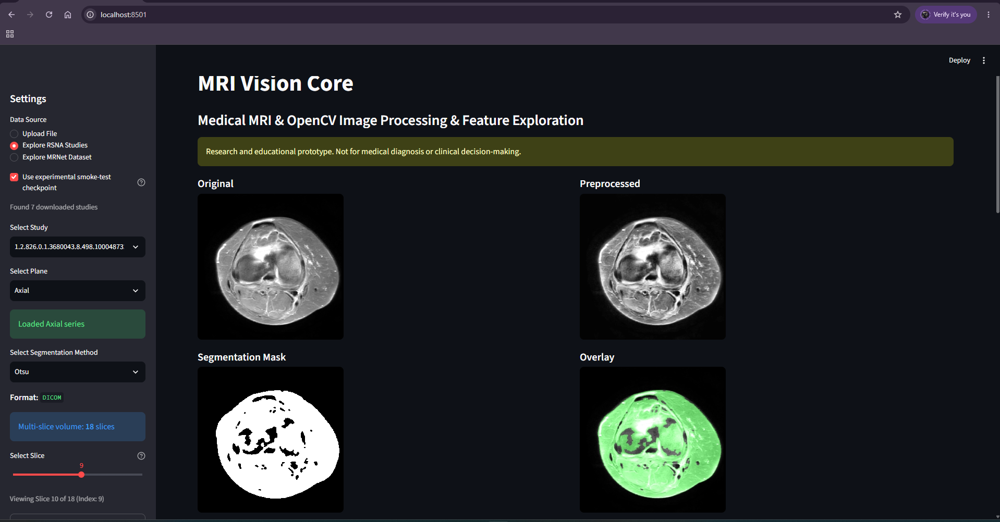
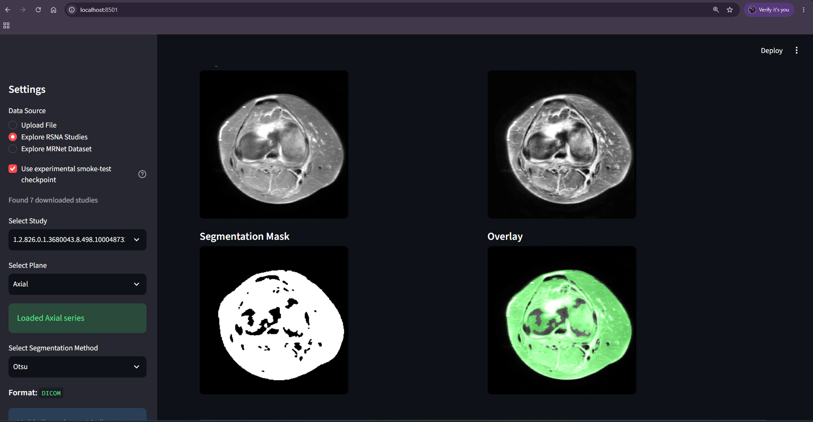
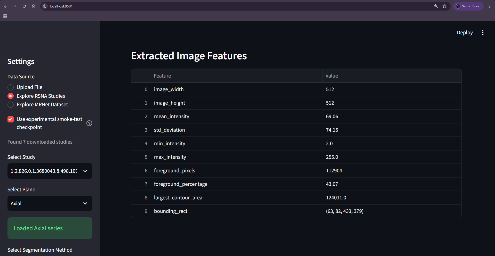
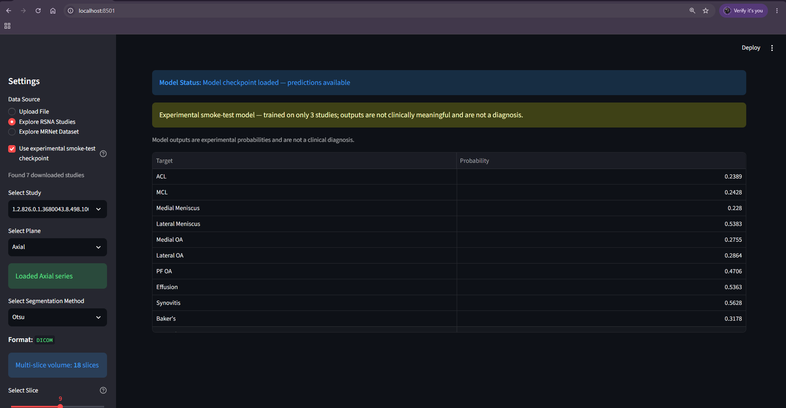
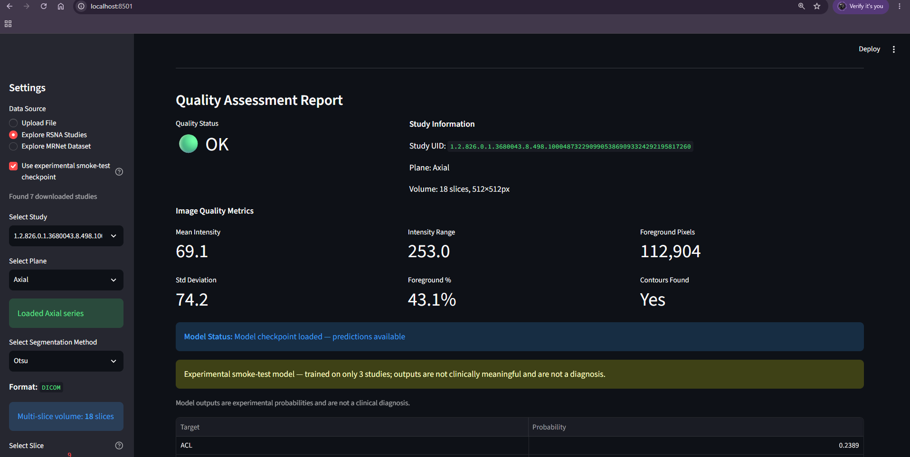
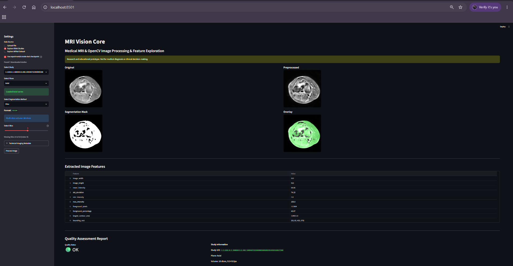

# MRI Vision Core — V0.4

Python/OpenCV MRI exploration with a Streamlit UI, Stanford MRNet label integration, and a lightweight CPU predictive baseline.

Research and educational prototype. Not for medical diagnosis or clinical decision-making.

> **Model-safety notice.** The Streamlit app can display experimental CNN probabilities for RSNA knee MRI studies. The only checkpoint that has been produced is a **smoke-test checkpoint**: it was trained for a few seconds on 3 training studies solely to validate the end-to-end software pipeline. Its predictions are **not a measure of clinical performance**, are not clinically meaningful, and are not a diagnosis. No sensitivity, specificity, accuracy, or clinical validation exists for any RSNA model in this repository.

See the [Visual walkthrough](#visual-walkthrough) for screenshots of the current application.

## Milestones

- **V0.1 completed:** Standard image loading, OpenCV preprocessing, threshold segmentation, overlays, and image features.
- **V0.2 completed:** DICOM/NIfTI loading, `MRIVolume`, slice navigation, and MRI-aware preprocessing.
- **V0.3 completed:** Stanford MRNet `.npy` loading, local plane/exam discovery, and UI exploration. The verified V0.3 baseline was **21 passing tests**, including a local MRNet check.
- **V0.4 completed:** Stanford MRNet label integration, validated examination manifests, and a first predictive baseline for abnormality, ACL tear, and meniscal tear. ROI selection is not this milestone.

## Architecture

The Streamlit application (`app.py`) uses the existing slice-processing core:

`loader.py` / `dataset_discovery.py` → `mri_volume.py` → `preprocessing.py` → `segmentation.py` → `features.py` / `visualization.py`, orchestrated by `pipeline.py`.

Supported inputs include DICOM, NIfTI, PNG/JPG, and MRNet NumPy volumes. The UI provides plane/exam selection, slice navigation, technical metadata, Otsu/adaptive masks, and overlays. The MRNet handcrafted-feature baseline runs through a separate CLI, while the experimental RSNA CNN inference path is integrated into the Streamlit app (see [Current application architecture](#current-application-architecture-rsna-workflow) below):

| Module | Responsibility |
|---|---|
| `mri_core/labels.py` | Strict label parsing, explicit anomaly recovery, task alignment, split validation |
| `mri_core/manifest.py` | ID-based joins, plane availability, separate external image paths, missing/ambiguous image checks |
| `mri_core/baseline_features.py` | Read-only sampled-slice handcrafted features |
| `mri_core/baseline.py` | Train-only fitting, held-out metrics, reproducible CLI and reports |

### Current application architecture (RSNA workflow)

The Streamlit app's **Explore RSNA Studies** mode runs two independent paths from the same DICOM volume and presents them side by side. The **deterministic path** (blue) uses classical image processing with no learned weights and produces the image-quality status. The **experimental path** (orange) is an optional CNN that outputs 12 probabilities. The two paths only meet in the `DecisionReport` container, which stores them in separate fields.



What the diagram means in the current implementation:

- **The quality path never sees the model.** Quality Status is computed only from the processed image, its measurements, and volume-level checks. CNN probabilities are validated (finite, within 0-1) and stored next to the status, but they cannot change it.
- **The model path does not use the 2D preprocessing or segmentation.** Model input is built directly from the DICOM series by the training dataset class, which applies its own per-slice normalization (1st/99th percentile clip) and bilinear resize.
- **Inference is study-level.** All three planes are used regardless of which plane is being viewed; each plane contributes one series (fluid-sensitive preferred, lowest `SeriesInstanceUID` as the tie-break). Up to 9 slices per plane are sampled at evenly spaced positions; shorter series use all their slices.
- **The model produces 12 ordered study-level binary targets** as raw logits, converted to probabilities with one sigmoid each: `ACL`, `MCL`, `Medial Meniscus`, `Lateral Meniscus`, `Medial OA`, `Lateral OA`, `PF OA`, `Effusion`, `Synovitis`, `Baker's`, `Contusion`, `Fracture`.
- **Streamlit presents both paths together**, and the CNN path degrades gracefully: with no checkpoint, an incomplete study, or an incompatible checkpoint, the app shows a non-fatal message and still renders the full quality report.

| Stage | Implementation |
|---|---|
| Study and plane discovery (read-only, tolerant of partial downloads) | `mri_core/rsna_integration.py` |
| DICOM series to ordered volume | `mri_core/dicom_series.py`, `mri_core/mri_volume.py`, `load_series_volume` / `select_series` in `mri_core/rsna_knee_dataset.py` |
| Preprocessing, segmentation, overlay, features | `mri_core/preprocessing.py`, `segmentation.py`, `visualization.py`, `features.py`, orchestrated by `pipeline.py` |
| Deterministic quality assessment and report container | `mri_core/decision.py` (`DecisionReport`, `generate_decision_report`) |
| Three-plane model input | `RSNAKneeDicomDataset` in `mri_core/rsna_knee_train.py` |
| Model | `RSNAKneeCNN` in `mri_core/rsna_knee_model.py` (shared encoder from `mri_core/cnn_model.py`, 3 planes, 12 outputs, 102,012 parameters) |
| Single-study inference | `run_inference` in `mri_core/rsna_knee_inference.py` (CPU, `model.eval()`, `torch.inference_mode()`, validated checkpoint) |
| UI | `app.py` |

**Deterministic quality assessment.** `generate_decision_report` evaluates the displayed slice after preprocessing and segmentation, plus volume-level facts. The status describes image and pipeline quality only and is never a clinical statement:

| Status | Meaning |
|---|---|
| `OK` | No quality rule was triggered. |
| `REVIEW` | At least one rule was triggered: foreground fraction outside 5-95%, intensity range below 10, fewer than 3 slices, image dimensions outside 64-4096 px, or foreground pixels without any contour. |
| `INVALID` | The volume contains no finite values. |

The thresholds are named constants in `mri_core/decision.py`. Threshold segmentation is not medically validated.

#### Experimental smoke checkpoint

- **Purpose.** It exists only to validate the end-to-end software path: local study, model input, checkpoint loading, inference, `DecisionReport`, and Streamlit display.
- **Provenance.** It was trained on CPU for a few seconds using the only 5 fully downloaded labeled studies at the time (3 for training, 2 for validation, 3 epochs). Only the epoch-1 weights were kept, and the validation ROC-AUC from 2 studies is uninformative. It is not a diagnostic or competitively trained model.
- **Availability.** It is generated locally under the git-ignored `outputs/` directory (`outputs/rsna-knee-smoke/checkpoint_smoke.pt`) and is not distributed with the repository. Without it, the app shows `Not available — model checkpoint not loaded`.
- **Opt-in only.** The sidebar checkbox **Use experimental smoke-test checkpoint** is off by default. Enabling it never overwrites or falls back to the normal checkpoint path (`outputs/rsna-knee/checkpoint_best.pt`), and the UI shows: *Experimental smoke-test model — trained on only 3 studies; outputs are not clinically meaningful and are not a diagnosis.*
- **Data scarcity.** Only 58 studies in the RSNA metadata have any labels (see the RSNA adapter section), so any RSNA model trained on this data would rest on at most 58 studies.

## Visual walkthrough

The screenshots below are from the current app running against a locally downloaded RSNA knee MRI study (Explore RSNA Studies mode).

**Workflow**

1. Select a locally available RSNA knee DICOM study.
2. Select the Axial, Coronal, or Sagittal plane.
3. Load the multi-slice DICOM volume.
4. Apply MRI-aware preprocessing to the selected slice.
5. Generate the segmentation mask and overlay visualization.
6. Extract deterministic image features.
7. Optionally enable the experimental smoke checkpoint.
8. Build the three-plane model input from sampled slices.
9. Run `RSNAKneeCNN`.
10. Convert the 12 logits into probabilities.
11. Generate the deterministic Quality Assessment Report independently of the model.
12. Present processing, inference, and quality results together in Streamlit.

### 1. RSNA DICOM Study Selection



*RSNA DICOM Study Selection — Real knee MRI study exploration with plane selection, multi-slice DICOM loading, and the full preprocessing/segmentation workflow visible in a single view.*

### 2. MRI Processing Pipeline



*MRI Processing Pipeline — Original axial DICOM slice, MRI-aware preprocessing, deterministic segmentation mask, and overlay visualization shown in a compact 2×2 workflow.*

### 3. Deterministic Image Features



*Deterministic Image Features — Reproducible measurements extracted from the processed MRI slice, including intensity statistics, foreground coverage, contour area, and bounding geometry.*

### 4. 12-Target RSNA Model Inference



*12-Target RSNA Model Inference — Experimental three-plane CNN outputs probabilities for 12 knee abnormality targets, with explicit smoke-test and non-diagnostic warnings.*

The probabilities shown come from the development smoke checkpoint and demonstrate the inference plumbing only. They are not a measure of clinical performance and must not be read as findings, risks, or predictions about the patient. The smoke checkpoint exists to validate the end-to-end software pipeline; its outputs are not clinically meaningful.

### 5. Deterministic Quality Assessment



*Deterministic Quality Assessment — Independent image-quality status and technical metrics remain separate from experimental model predictions, supporting transparent and auditable MRI processing.*

Quality Status is generated from deterministic image and processing checks (foreground coverage, intensity range, slice count, image size, contour detection, and finite values). It is not changed by the CNN probability outputs: the same study produces the same status whether or not a checkpoint is loaded.

### 6. MRI Vision Core End-to-End



*MRI Vision Core End-to-End — RSNA DICOM study selection, preprocessing, segmentation, feature extraction, experimental 12-target inference, and deterministic quality assessment integrated into a single Streamlit workflow.*

> Research and educational prototype. Not for medical diagnosis or clinical decision-making. The smoke checkpoint exists to validate the end-to-end software pipeline; its predictions are not a measure of clinical performance.

## Setup and execution

PowerShell, from the repository root:

```powershell
python -m venv .venv
.\.venv\Scripts\python.exe -m pip install -r requirements.txt
.\.venv\Scripts\python.exe -m streamlit run app.py
```

Modeling uses scikit-learn (`StandardScaler`, `LogisticRegression`, and `DummyClassifier`); no deep-learning framework is required.

## Tests

The suite collects **74 tests**. The portable default runs **72 synthetic tests**, with **2 optional local MRNet checks skipped**. All 74 passed locally with the dataset enabled before the real baseline was run.

```powershell
# Portable CI: no real dataset required or read.
.\.venv\Scripts\python.exe -B -m pytest -q -p no:cacheprovider

# Opt-in, read-only integration checks at D:\MRI_DATASETS\MRNet.
.\.venv\Scripts\python.exe -B -m pytest -q -p no:cacheprovider --run-mrnet
```

Synthetic tests cover shuffled label joins, leading zeros, malformed rows, explicit recovery, duplicates, task mismatch, split overlap, missing planes, ambiguous images, deterministic features, invalid volumes, metric calculations, and the CLI. A leakage regression test changes validation features and labels and confirms that fitted scaler statistics, logistic coefficients, and dummy priors do not change. The synthetic CLI test verifies source-file hashes remain unchanged.

## Local MRNet inputs and label validation

The current local dataset is external to the repository:

```text
D:\MRI_DATASETS\MRNet\
  MRNet_ Knee MRI's_files\
    axial\       0000.npy ... 1249.npy
    coronal\     0000.npy ... 1249.npy
    sagittal\    0000.npy ... 1249.npy
  labels\
    train_abnormal.csv
    train_acl.csv
    train_meniscus.csv
    valid_abnormal.csv
    valid_acl.csv
    valid_meniscus.csv
```

Label files are headerless, two-column `exam_id,label` tables. IDs must be exactly four ASCII digits and remain strings, preserving leading zeros. Labels must be exactly `0` or `1`. Each task must contain the same IDs within its split; duplicate IDs, conflicting records, missing tables, malformed or blank rows, and train/validation overlap are rejected. Row order is irrelevant. Split membership comes from the tables, never ID ranges or folder names.

The local CSVs have a known first-row anomaly: `"_0000","_1"` in training abnormal, `"_0000","_0"` in the other training tables, and `"_1130","_0"` in all validation tables. Strict mode rejects these rows. **`--recover-first-row` explicitly permits this exact first-row pattern**, removes one leading underscore from both fields in memory, and records the original and recovered values in console output and `report.json`. It never silently discards a row, treats it as a header, or edits a source CSV. Ordinary headerless tables need no compatibility option.

The resulting manifest has one row per examination with:

```text
exam_id,split,axial_available,coronal_available,sagittal_available,abnormal,acl,meniscus
```

Image paths are resolved separately from all matching plane directories, including nested split layouts. Duplicate ID/plane files are rejected. Missing and unlabeled images are reported; the baseline refuses to fit until the mapping is complete. CSV consumers must read `exam_id` as text to retain leading zeros.

## First predictive baseline

```powershell
.\.venv\Scripts\python.exe -B -m mri_core.baseline `
  --dataset-root D:\MRI_DATASETS\MRNet `
  --labels-dir D:\MRI_DATASETS\MRNet\labels `
  --output-dir outputs\v0.4 `
  --recover-first-row
```

Omit `--recover-first-row` for standard CSVs. `--labels-dir` defaults to `<dataset-root>/labels`. The dataset is optional for installing the project and running CI.

Feature extraction opens external `.npy` arrays with `mmap_mode="r"` and `allow_pickle=False`, using axis 0 as the slice axis. Each plane contributes nine evenly spaced slices including endpoints, or all slices for shorter volumes. Each slice is independently clipped and normalized using its 1st/99th percentiles; a constant slice becomes zero. Sampled slices must be finite, numeric, and at least 2×2.

Ten slice statistics are computed: intensity mean, standard deviation, 10th/50th/90th percentiles, 32-bin entropy, gradient magnitude mean/standard deviation/90th percentile, and fraction of pixels with gradient magnitude above 0.1. Means and standard deviations across sampled slices yield 20 features per plane. Concatenating axial, coronal, and sagittal features gives **60 features per examination**. Normalization uses only the current slice; it learns no population parameters.

For each target, a separate `StandardScaler` → `LogisticRegression` pipeline uses fixed `C=1.0`, `class_weight="balanced"`, `solver="lbfgs"`, `max_iter=2000`, and `random_state=0`. A `DummyClassifier(strategy="prior")` provides a comparison. **Only training examinations are passed to every `.fit()` call**, including scaling, class weights, and dummy priors. Validation is used once for evaluation, without hyperparameter search, calibration, or threshold tuning. All binary metrics use a fixed probability threshold of **0.5**. Nonconvergence stops execution.

Derived artifacts are written under ignored `outputs/v0.4/`:

- `manifest.csv`: labels, splits, and plane availability.
- `features.csv`: examination IDs, splits, and 60 numeric features.
- `report.json`: class distributions, logistic/dummy metrics, recovery records, source label SHA-256 hashes, timings, configuration, feature names, software versions, and limitations.

No MRI arrays are copied into the repository. The CLI rejects output locations overlapping source directories. Feature extraction time covers image reads and feature calculation; training time covers all three scaler/logistic fits and three dummy fits, excluding evaluation and artifact writing.

Metrics include ROC-AUC, average precision, accuracy, precision, recall, F1, and confusion matrices in **`[[TN, FP], [FN, TP]]`** order. Undefined ROC-AUC/AP values are JSON `null` with explanatory notes. Precision/recall/F1 use `zero_division=0`, also reported in notes when applicable.

## Local V0.4 results

The 2026-09-19 run used 1,250 examinations: **1,130 train / 120 validation**, with all three planes available for every exam (3,750 external image files). There were no missing or unlabeled exams and no split overlap. Six first-row recoveries were explicitly recorded; no source labels were rewritten.

| Target | Train negative / positive | Train prevalence | Validation negative / positive | Validation prevalence |
|---|---|---:|---|---:|
| Abnormal | 217 / 913 | 80.80% | 25 / 95 | 79.17% |
| ACL | 922 / 208 | 18.41% | 66 / 54 | 45.00% |
| Meniscus | 733 / 397 | 35.13% | 68 / 52 | 43.33% |

Validation metrics at the fixed 0.5 threshold (AP = average precision):

| Target | Model | ROC-AUC | AP | Accuracy | Precision | Recall | F1 | Confusion matrix |
|---|---|---:|---:|---:|---:|---:|---:|---|
| Abnormal | Logistic | 0.8552 | 0.9365 | 0.8167 | 0.9294 | 0.8316 | 0.8778 | `[[19,6],[16,79]]` |
| Abnormal | Dummy | 0.5000 | 0.7917 | 0.7917 | 0.7917 | 1.0000 | 0.8837 | `[[0,25],[0,95]]` |
| ACL | Logistic | 0.8171 | 0.7877 | 0.7417 | 0.7091 | 0.7222 | 0.7156 | `[[50,16],[15,39]]` |
| ACL | Dummy | 0.5000 | 0.4500 | 0.5500 | 0.0000 | 0.0000 | 0.0000 | `[[66,0],[54,0]]` |
| Meniscus | Logistic | 0.7240 | 0.6239 | 0.6667 | 0.5909 | 0.7500 | 0.6610 | `[[41,27],[13,39]]` |
| Meniscus | Dummy | 0.5000 | 0.4333 | 0.5667 | 0.0000 | 0.0000 | 0.0000 | `[[68,0],[52,0]]` |

The ACL and meniscus dummy models predict no positives; their precision is set to zero with an explicit note in the report. Logistic regression improves ranking metrics and accuracy for all three targets, but the always-positive abnormality dummy has slightly higher F1. No settings were adjusted after observing these results.

Feature extraction took **179.205 seconds**; training the three scaled logistic models and three dummy models took **0.106 seconds** on this machine. These are single-run wall-clock measurements, not benchmark guarantees. The run used Python 3.12.10, NumPy 2.5.3, and scikit-learn 1.9.1. Exact metrics and provenance are in the locally generated, ignored `outputs/v0.4/report.json`.

## Limitations

- Handcrafted slice summaries do not localize tears or provide diagnostic evidence; sampled slices may miss focal findings.
- Per-slice normalization removes absolute intensity scale. Planes are concatenated, not spatially registered.
- The validation set has only 120 examinations; there are no confidence intervals or independent external test results.
- ACL prevalence differs substantially between training and validation. Fixed balanced weights do not establish calibrated probabilities.
- Examination IDs are separated across splits; this does not verify patient-level independence.
- The UI's threshold segmentation remains separate from the predictive baseline and is not medically validated.

Future work should evaluate stronger features and robustness without repeatedly tuning against this validation split. ROI tools, deep segmentation, volumetric radiomics, and an API remain possible later milestones.

## RSNA Knee Abnormality Detection adapter

The RSNA adapter is metadata-first and supports the verified CSV layout under `data/rsna-knee/` without requiring the approximately 570 GB DICOM collection. It preserves `StudyInstanceUID` and `SeriesInstanceUID` as strings, groups series by study, exposes `Fluid_Sensitive`, `Fat_Suppression`, and `Anatomical_Plane`, and reports whether `train_series/<StudyInstanceUID>/<SeriesInstanceUID>/` and `test_series/<StudyInstanceUID>/<SeriesInstanceUID>/` exist. The exact 12 targets are `ACL`, `MCL`, `Medial Meniscus`, `Lateral Meniscus`, `Medial OA`, `Lateral OA`, `PF OA`, `Effusion`, `Synovitis`, `Baker's`, `Contusion`, and `Fracture`.

The current local metadata inspection found **4,407 training studies**, **3 test studies**, and **24,371 training series**. Series per study range from 3 to 14, with mean 5.5301 and median 5. The series counts are Sagittal 9,864, Coronal 8,609, and Axial 5,898. Fluid-sensitive counts are 14,010 true / 10,361 false; fat-suppression counts are 14,010 true / 10,361 false. Only **58 studies have complete 12-target labels**; 4,349 rows have every target missing. Training must therefore use only complete-label studies and must not treat missing labels as negatives.

Inspect metadata now:

```powershell
.\.venv\Scripts\python.exe -B scripts\kaggle_rsna_knee.py inspect --data-dir data\rsna-knee
```

With DICOM data attached later, the future commands are:

```powershell
.\.venv\Scripts\python.exe -B scripts\kaggle_rsna_knee.py train --data-dir <path> --config configs\rsna_knee.json
.\.venv\Scripts\python.exe -B scripts\kaggle_rsna_knee.py evaluate --data-dir <path> --checkpoint <path>
.\.venv\Scripts\python.exe -B scripts\kaggle_rsna_knee.py submit --data-dir <path> --checkpoint <path> --output submission.csv
```

The model reuses the V0.5 shared encoder with a 12-logit head and applies one sigmoid probability per target. Training uses study-level splitting, `BCEWithLogitsLoss`, the configured seed, CUDA when available, CPU otherwise, and best-checkpoint selection by macro ROC-AUC. Per-label ROC-AUC is reported when both validation classes are present; single-class validation labels are reported as unavailable instead of raising. Submission generation takes the exact column order and study IDs from `sample_submission.csv`. Source CSVs, DICOM directories, checkpoints, and generated submissions are ignored by Git.

## V0.5 CNN experiment

V0.5 adds an optional PyTorch path that is separate from Streamlit and preserves the V0.4 handcrafted-feature baseline. Install the optional dependency in a separate environment; the base `requirements.txt` does not require PyTorch:

```powershell
.\.venv\Scripts\python.exe -m pip install -r requirements-cnn.txt
```

The reference CNN uses a shared four-block 2D encoder (16, 32, 64, and 128 channels), GroupNorm, ReLU, spatial mean pooling, masked max pooling across nine sampled slices, plane concatenation, dropout, and three independent logits for abnormality, ACL tear, and meniscal tear. It has 97,779 trainable parameters in the reference configuration. Inputs are grayscale, 128×128, and use the existing per-slice 1st/99th percentile normalization. Training augmentation applies one deterministic affine/contrast transform to all slices of a plane; validation has no augmentation. BCE-with-logits uses positive weights computed from training labels only.

Local execution is intentionally limited to synthetic CPU smoke tests. Full MRNet training refuses CPU and requires CUDA. The CPU smoke command creates temporary synthetic arrays and labels, then verifies dataset tensors, forward/loss/backward/optimizer behavior, checkpoint reload, prediction generation, and metrics:

```powershell
.\.venv\Scripts\python.exe -B -m mri_core.cnn_train smoke
```

The Kaggle-ready entrypoint is `scripts/kaggle_cnn.py`. Attach the Stanford arrays and six label CSVs as a Kaggle input dataset; keep the source files under `/kaggle/input` and write derived artifacts under `/kaggle/working`. Select the documented NVIDIA T4×2 accelerator, use `cuda:0`, and run the one-epoch benchmark first:

```bash
pip install -r requirements-cnn.txt
python scripts/kaggle_cnn.py benchmark \
  --dataset-root /kaggle/input/mrnet/MRNet_ Knee MRI's_files \
  --labels-dir /kaggle/input/mrnet/labels \
  --output-root /kaggle/working/outputs/v0.5 \
  --recover-first-row
```

After inspecting the benchmark report, launch the fixed three-seed experiment with the same paths:

```bash
python scripts/kaggle_cnn.py train \
  --dataset-root /kaggle/input/mrnet/MRNet_ Knee MRI's_files \
  --labels-dir /kaggle/input/mrnet/labels \
  --output-root /kaggle/working/outputs/v0.5 \
  --recover-first-row
```

The benchmark and training commands require the V0.4 manifest fingerprint and exact 1,130/120 train/validation split. They reject missing or unlabeled images, split changes, and CPU full runs. Each run records its config, source hashes, environment, sampling indices, checkpoints, predictions, losses, timings, and per-seed comparison metrics under the output directory. No source arrays or CSVs are copied into Git.

Planning estimates for the reference configuration are 10–45 minutes for the three-plane, 20-epoch run on a typical Kaggle T4-class GPU, 2–4 GB VRAM, and roughly 1–3 MB per checkpoint. The first epoch benchmark replaces these estimates with measured timing and peak CUDA memory. The current local machine has no CUDA-capable PyTorch device, so no real-data CNN run has been started.
